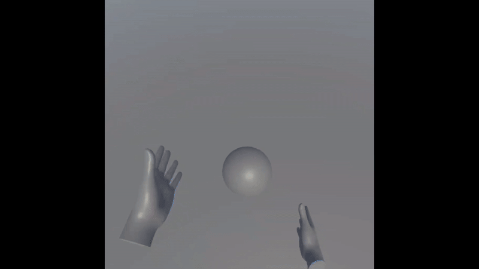

# Unity VR URP Minimal Example

Usage:

* Install 2022.3.16f1 from Unity Hub

* Unity Hub -> Installs -> 2022.3.16f1 -> Gear Icon -> Add Modules -> Install Android Build Support, OpenJDK, Android SDK & NDK Tools

* Open project, select scene SampleScene. 

* File -> Build Settings -> Build. Then install APK via Sidequest to Quest 2/3 device. Play.

